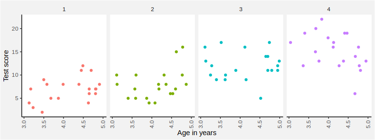

myAnalysis
================
Andreas
May 2, 2019

Load data:

``` r
library(tidyverse)

theme_set(theme_classic() +
            theme(strip.background = element_blank(),
                  plot.background = element_rect(fill = "grey95"),
                  legend.background = element_rect(fill = NA),
                  axis.text.x = element_text(angle = 90,
                                             vjust = 0.5)))

d <- read.csv("../data/gitar_data.csv")
```

Plot:

``` r
ggplot(d,
       aes(x = age,
           y = score,
           color = as.factor(group))) +
  geom_point() +
  facet_grid(. ~ group) +
  scale_x_continuous(name = "Age in years") +
  scale_y_continuous(name = "Test score") +
  scale_color_discrete(guide = F)
```


